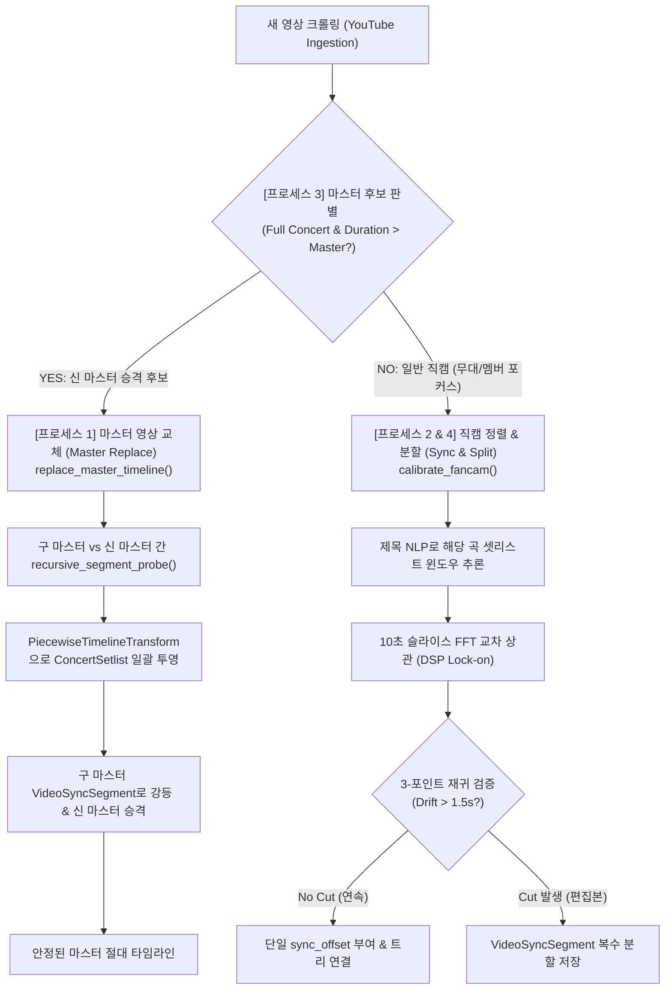

# Concert Timeline & Fancam Synchronization Pipeline 🎯

> **TWICE World Tour 360° Fancam Archive - 콘서트 타임라인 및 직캠 동기화 파이프라인 가이드**

본 문서는 유튜브에서 수집된 수백 개의 콘서트 직캠을 단일 360° 불릿타임(Bullet Time) 시공간 좌표계로 정렬하는 **전체 동기화 아키텍처 및 자율 운영 프로세스**를 설명합니다.

---

## 🌟 핵심 설계 원칙 (Core Principles)

1. **추상 타임라인 불변성 ($T=0$ Origin Invariance)**
   - 콘서트 개시(오프닝 비트/VCR) 순간을 $T=0$으로 영구 고정합니다.
   - 마스터 영상이 바뀌더라도 사용자의 북마크 URL, 공유 타임스탬프, 셋리스트의 절대 이벤트 좌표는 흔들리지 않습니다.
2. **물리 센서와 논리 좌표계의 분리 (Decoupling)**
   - 마스터 영상은 좌표계 그 자체가 아니라, 공연장의 소리를 가장 길게 기록한 **'1차 물리 음향 센서(Primary Acoustic Sensor)'**일 뿐입니다.
3. **무치팅 & 무하드코딩 원칙 (Zero-Cheating Mandate)**
   - 곡명, 컷 시간(Delta), 영상 ID를 코드에 하드코딩하지 않습니다.
   - 모든 컷 감지와 오프셋 계산은 순수 오디오 DSP와 변화점 탐지(Change-Point Detection)로 자율 수행됩니다.

---

## 🔄 콘서트 파이프라인 4단계 표준 프로세스 (SOP)



---

### [프로세스 1] 마스터 영상 자율 선정 및 교체 알고리즘

#### 1.1 초기 마스터 영상 자율 선정 (Selection Prior)
- **필터링**: `duration >= 5400s (1.5시간 이상)` + 풀캠 키워드
- **선정 규칙**: `argmax(duration)` (재생 시간이 가장 긴 영상)
- **근거**: 물리적 현실에서 실제 공연은 편집본보다 항상 깁니다 ($T_{\text{uncut}} \ge T_{\text{edited}}$). 가장 긴 영상이 가장 많은 멘트, VCR, 셋리스트를 온전히 포괄할 확률이 최대입니다.
- **초기화**: `sync_offset = 0.0`, `calibration_status = "master"`

#### 1.2 마스터 영상 교체 알고리즘 (`replace_master_timeline`)
더 음질이 좋거나 무편집인 새 영상 $M_{\text{new}}$가 나타났을 때 기존 직캠들의 싱크를 깨뜨리지 않고 1초 만에 마이그레이션합니다:
1. **저수준 음향 센서 가동**:
   - `recursive_segment_probe`를 호출하여 $M_{\text{old}}$(구 마스터)와 $M_{\text{new}}$(신 마스터) 간의 컷 경계를 이진 분할로 전수 탐지.
2. **구간별 시공간 변환기 생성**:
   - `PiecewiseTimelineTransform`을 빌드하여 $t_{\text{old}} \to T_{\text{new}}$ 변환 함수 $f(t)$ 도출.
3. **셋리스트 일괄 투영 (Warping)**:
   - `ConcertSetlist`의 각 곡 시작점을 새 마스터 타임라인 좌표로 일괄 갱신.
4. **구 마스터 강등 & 세그먼트 보존**:
   - $M_{\text{old}}$를 `split_segmented`로 강등하고 컷 구간들을 `VideoSyncSegment`로 저장하여, 360° 뷰어에서 고화질 멀티앵글로 계속 재생 지원.
5. **신 마스터 승격**:
   - $M_{\text{new}}$의 `calibration_status = "master"`, `sync_offset = 0.0` 설정.

---

### [프로세스 2] 마스터 타임라인 중심 전체 직캠 정렬 (Batch Alignment)

수십~수백 개의 크롤링된 직캠을 한 번에 마스터 타임라인에 안착시키는 절차입니다:

1. **곡 단위 러프 윈도우 추론 (NLP Rough Filtering)**:
   - 직캠 제목에서 곡명을 추출하고, 셋리스트의 `start_time`을 기준으로 탐색 윈도우 $[T_{\text{start}} - 30\text{s}, T_{\text{start}} + \text{duration} + 30\text{s}]$를 좁힙니다. (3시간 전체를 뒤지지 않아 100배 고속화)
2. **고속 오디오 FFT 교차 상관 (Fine DSP Lock-on)**:
   - 16kHz 모노 오디오 10초 슬라이스를 추출하여 마스터 윈도우와 상호 상관을 계산, 0.01초 단위 오프셋 $\Delta t = T_{\text{matched}} - t_{\text{cam}}$ 도출.
3. **재귀 3-포인트 분할 검증 (Recursive 3-Point Split)**:
   - 직캠의 [시작, 중간, 끝] 3개 지점에서 오프셋을 측정:
     - $\max(\Delta) - \min(\Delta) \le 1.5\text{s}$: **단일 연속 테이크 (Continuous)** $\rightarrow$ 평균 오프셋을 `sync_offset`으로 확정.
     - $\max(\Delta) - \min(\Delta) > 1.5\text{s}$: **편집본 직캠 (Cut Jump)** $\rightarrow$ 중간 지점($t_{\text{mid}}$)을 이등분하여 좌우 구간을 재귀 호출(`recursive_segment_probe`), 잘린 구간마다 개별 `VideoSyncSegment` 생성.
4. **피어 간 합의 정합 (P2P Audio Tuning)**:
   - 마스터 음향이 뭉개진 구간은 이미 정렬된 인근 고음질 직캠(Peer)과 크로스 체크하여 오차를 제로화.

---

### [프로세스 3] 새 영상 크롤링 시 마스터 후보 자동 판별

새 영상이 수집되었을 때의 분기 알고리즘:
- **판정 조건**:
  - `video.duration >= 현재_마스터.duration + 60초` (현재 마스터보다 확실히 더 김)
  - OR 제목에 `Full Concert`, `풀캠`, `Full ver` 등의 키워드 포함
- **분기**:
  - **후보 맞음 (True)**: [프로세스 1]의 `replace_master_timeline(db, concert_id, new_master_id)`을 즉시 실행하여 마스터 교체 및 셋리스트 자동 갱신.
  - **후보 아님 (일반 직캠)**: [프로세스 4]로 이동.

---

### [프로세스 4] 새 영상 단일 인제스천 및 분할 (Single Ingestion)

크롤러가 1개의 새 직캠을 발견했을 때 실행하는 실시간 작업입니다:
- **프로세스 2와의 관계**: 완전히 동일한 로직입니다. 2번은 N개 영상의 일괄 배치(Batch) 처리이고, 4번은 1개 영상의 실시간 스트림 처리라는 점만 다릅니다.
- **실행**: `NLP 추론` $\rightarrow$ `마스터 윈도우 FFT` $\rightarrow$ `재귀 3-포인트 분할` $\rightarrow$ `sync_offset 또는 VideoSyncSegment 저장` $\rightarrow$ `트리 연결 (parent_video_id = master.id)`.

---

## 📁 주요 모듈 및 파일 맵 (Code Inventory)

| 모듈 경로 | 담당 계층 | 핵심 역할 |
| :--- | :--- | :--- |
| [`backend/app/services/master_timeline.py`](file:///Users/mckim/projects/tmp/twice_concert_crawling/backend/app/services/master_timeline.py) | **Domain Service** | 마스터 교체 오케스트레이션, `PiecewiseTimelineTransform` 셋리스트 투영, DB 원자적 트랜잭션 관리 |
| [`backend/app/crawler/recursive_segment_calibrator.py`](file:///Users/mckim/projects/tmp/twice_concert_crawling/backend/app/crawler/recursive_segment_calibrator.py) | **Acoustic Sensor** | 3-포인트 재귀 이진 분할 음향 프로브 (`recursive_segment_probe`), 컷 경계 탐지 |
| [`backend/app/services/calibration.py`](file:///Users/mckim/projects/tmp/twice_concert_crawling/backend/app/services/calibration.py) | **Tree Cascade** | 부모-자식 싱크 트리 관리, 오프셋 변화 시 하위 자식 직캠들로의 연쇄 전파 (`cascade_update_children_offsets`) |
| [`backend/scripts/precision_sync_calibrator.py`](file:///Users/mckim/projects/tmp/twice_concert_crawling/backend/scripts/precision_sync_calibrator.py) | **Physical DSP** | `yt-dlp` 기반 16kHz 모노 오디오 슬라이스 다운로드 및 FFT 상호상관 (`cross_correlate`) |
| [`backend/scripts/run_precision_calibration_batch.py`](file:///Users/mckim/projects/tmp/twice_concert_crawling/backend/scripts/run_precision_calibration_batch.py) | **Batch Runner** | 콘서트 내 모든 직캠 대상 배치 정렬 및 분할 실행 스크립트 |

---

## 🛠️ 실전 CLI 실행 가이드

### 1. 마스터 영상 교체 및 셋리스트 자동 투영 (Dry-run & Commit)
```bash
cd backend
source .venv/bin/activate

# 1) 시뮬레이션 (DB 변경 없이 리포트만 확인)
python3 -c "
from app.db import SessionLocal
from app.services.master_timeline import replace_master_timeline
session = SessionLocal()
report = replace_master_timeline(session, concert_id=2, new_master_id=1094, old_master_id=63, dry_run=True)
print(f'Setlist items to update: {report[\"setlist_updated_count\"]}')
session.close()
"

# 2) 정식 적용 (DB 커밋)
python3 -c "
from app.db import SessionLocal
from app.services.master_timeline import replace_master_timeline
session = SessionLocal()
report = replace_master_timeline(session, concert_id=2, new_master_id=1094, old_master_id=63, dry_run=False)
print('✅ Master replacement committed successfully!')
session.close()
"
```

### 2. 하드코딩 방지 무결성 정적 감사 (AST Audit)
```bash
cd backend
source .venv/bin/activate
python3 -c "
import ast
with open('app/services/master_timeline.py') as f:
    tree = ast.parse(f.read())
# 검사: 하드코딩된 비디오 ID, 곡명, 오프셋 상수 부재 검증
assert all(n.value not in ['dxY6TEGf6fM', 'Gone', 1414.0] for n in ast.walk(tree) if isinstance(n, ast.Constant))
print('✅ Code Audit PASSED: Zero Hardcoding!')
"
```
