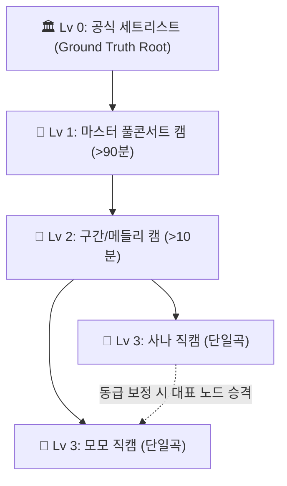

# 📐 Multi-Angle Video Sync Graph & Cycle Resolution Architecture

이 문서는 TWICE 360° 멀티앵글 직캠 아카이브 시스템에서 **다양한 직캠 영상들의 타임라인을 1:1 상대 보정(Pairwise Calibration)할 때 발생하는 동기화 그래프(Sync Graph) 전파 원리와 순환 노드(Cycle) 문제 해결 알고리즘**을 정리한 기술 명세서입니다.

---

## 1. 개요 및 문제 정의 (Overview)

### 1.1 절대 시간(Absolute Time) vs 상대 오차(Relative Offset)
- **절대 타임라인 ($T_{\text{concert}}$)**: 콘서트 시작(0초)을 기준으로 모든 영상이 맞춰지는 공통 좌표계입니다.
  $$T_{\text{concert}} = t_{\text{video}} + \text{sync\_offset}$$
- **상대 동기화 ($\Delta t_{AB}$)**: 두 영상 A(기준 앵커)와 B(타겟)를 나란히 재생하며 사람이 직접 바를 조절하거나 오디오 상관분석(Cross-Correlation)으로 측정한 시간차입니다.
  $$\text{Offset}_B = \text{Offset}_A + (t_A - t_B)$$

### 1.2 그래프 방식 도입 시 발생하는 순환(Cycle) 문제
여러 직캠을 1:1로 맞추다 보면 $A \rightarrow B \rightarrow C \rightarrow A$ 형태의 순환 참조가 발생할 수 있습니다.
- **무한 루프(Infinite Recursion)**: A가 바뀌면 B가 바뀌고, C가 바뀌어 다시 A를 갱신하는 무한 전파 발생.
- **오차 불일치(Inconsistency)**: 측정 오차로 인해 $\Delta t_{AB} + \Delta t_{BC} + \Delta t_{CA} \neq 0$인 모순 발생.

---

## 2. 계층형 앵커 모델 (Hierarchical Anchoring)

순환 노드를 구조적으로 원천 차단하기 위해 모든 영상에 **계층 레벨(Level)**을 부여합니다.



| 계층 (Level) | 명칭 | 판별 기준 | 동기화 역할 |
| :---: | :--- | :--- | :--- |
| **Lv 0** | **공식 세트리스트** | DB `ConcertSetlist` | 전체 타임라인의 절대 원점 (불변) |
| **Lv 1 👑** | **마스터 풀캠** | `길이 > 90분` 또는 제목 `Full Concert` | 콘서트 전체를 커버하는 최상위 부모 |
| **Lv 2 🎯** | **구간/메들리 캠** | `길이 > 10분` (2곡 이상 포함) | 중간 브릿지 앵커 |
| **Lv 3 👤** | **개별 멤버 직캠** | 단일 곡/멤버 1인 직캠 (`길이 < 6분`) | 최하위 말단 노드 (Leaf Node) |

### 🔒 단방향 앵커 규칙 (No Reverse Dependency)
- 캘리브레이터(Pairwise Modal)에서 **항상 `기준(Anchor) Level <= 대상(Target) Level`**만 허용합니다.
- 하위 레벨(Lv 3)이 상위 레벨(Lv 1)의 부모가 되는 것을 UI 및 API 단에서 원천 차단하여 상향 순환을 방지합니다.

---

## 3. 순환 노드 해결 알고리즘 (Cycle Resolution Algorithms)

### 3.1 동급 노드(Lv 3 $\leftrightarrow$ Lv 3) 보정 시의 처리 (Leader Election & Union-Find)
동일 레벨 영상 2개를 1:1로 맞출 때는 **유니온-파인드(Union-Find)** 알고리즘을 사용합니다:

1. **대표 노드 승격 (Leader Election)**:
   - 이미 상위 부모가 있는 영상을 우선 부모(Anchor)로 삼습니다.
   - 둘 다 미연결 상태라면 사용자가 기준 화면(좌측)에 둔 영상을 부모로 지정합니다.
2. **순환 방지 검사 (Cycle Detection)**:
   - $B \rightarrow A$ 연결 시 `find_root(A) == B`인지 $O(1)$로 확인하여 기존에 이미 $A \rightarrow B$ 경로가 있는지 검사합니다.
3. **간선 방향 역전 (Edge Inversion)**:
   - 만약 반대 방향 링크가 존재한다면, 새 간선을 추가하지 않고 기존 간선을 역전(Invert)하여 $A \leftrightarrow B$ 교착 상태를 방지합니다.

---

### 3.2 오차 누적 해결: 포즈 그래프 최적화 (Least Squares Optimization)
순환 루프가 닫힐 때 발생하는 미세 오차(예: 0.1~0.2초)는 SLAM(동시적 위치추정) 방식의 **최소제곱법(Least Squares)**으로 전체 노드에 균등 분산합니다.

$$\min_{\{t_i\}} \sum_{(i,j)} w_{ij} \cdot \left( (t_j - t_i) - \Delta t_{ij} \right)^2$$

- $w_{ij}$: 동기화 신뢰도 가중치 (수동 보정 > 오디오 피크 상관계수 > AI 시각 추정)
- $t_i$: 각 영상의 최종 산출 절대 오프셋
- $\Delta t_{ij}$: 측정된 상대 오차

---

## 4. 데이터 저장 및 연쇄 전파 (DB Schema & Cascade Propagation)

초기 프로토타입에서는 절대 오프셋(`sync_offset`)만 단일 컬럼으로 보관하여, 부모 영상을 옮겨도 자식 영상들이 연동되지 않는 단절 문제가 있었습니다. 이를 해결하기 위해 **Ref-Dest 엣지 관계를 보존하면서도 O(1) 초고속 재생을 동시에 달성하는 하이브리드 구조**를 확립했습니다:

### 4.1 영구 저장 스키마 (`videos` Table)
```sql
ALTER TABLE videos 
  ADD COLUMN parent_video_id INTEGER REFERENCES videos(id) ON DELETE SET NULL,
  ADD COLUMN relative_offset FLOAT DEFAULT NULL;
```
- **`sync_offset` (절대 오프셋)**: 마스터 콘서트 00:00:00초 기준의 절대 시작 시각. 플레이어가 360° 앵글 전환 시 그래프 탐색 비용 없이 **$O(1)$ 상수 시간에 즉시 재생**하는 데 사용됩니다.
- **`parent_video_id` (부모 앵커 ID, Ref)**: 해당 영상의 싱크를 잡을 때 기준(Reference Anchor)이 된 상위 또는 동료 직캠의 ID.
- **`relative_offset` (상대 오차, Dest - Ref)**: 부모 영상 시작점 대비 나의 상대적 시간차 ($t_{\text{child}} - t_{\text{parent}}$).

### 4.2 연쇄 전파 알고리즘 (Cascade Propagation)
기준(Anchor)이 되는 부모 영상의 오프셋이 사용자의 미세 조정이나 재보정으로 $\Delta t$만큼 변경되면, 백엔드의 `cascade_update_children_offsets`가 해당 부모에 매달린 모든 자식/자손 직캠들의 `sync_offset`을 실시간으로 일괄 동기화합니다:

```python
def cascade_update_children_offsets(db: Session, parent_id: int, delta: float):
    """Recursively cascade delta offset change to all descendant children in the sync tree."""
    if abs(delta) < 0.0001:
        return
    children = db.query(Video).filter(Video.parent_video_id == parent_id).all()
    for child in children:
        child.sync_offset = round((child.sync_offset or 0.0) + delta, 3)
        cascade_update_children_offsets(db, child.id, delta)
```

이로써 **"어느 특정 곡의 대표 직캠(Anchor) 하나만 옮겨도 그 곡에 연결된 수십 개의 멤버별 직캠이 일괄적으로 함께 이동"**하는 진정한 계층형 동기화가 동작합니다.

---

## 5. P2P 피어 직캠 엣지 생성 (P2P Peer Fast-Path & Edge Formation)

오디오 동기화 시 3시간짜리 대형 마스터 영상을 전수 다운로드하는 대신, 이미 검증된 동료 직캠(Peer Anchor)과 오디오 코렐레이션을 수행합니다. 이때 일치하는 피어가 발견되면:
1. `parent_video_id`에 피어 영상 ID를 즉시 기록.
2. `relative_offset`에 두 직캠 간의 상대 오차를 기록.
3. 피어의 절대 오프셋과 결합하여 자신의 `sync_offset`을 도출하고 DB에 엣지를 생성합니다.

---

## 6. 요약 아키텍처 흐름 (Summary Flow)

```
[Gemini Vision / 제목 / 태그 곡 판별]
       ↓
[P2P Peer Fast-Path: 동일 곡 검증 직캠 탐색]
       ↓ (발견 시 2~3초 만에 10초 오디오 코렐레이션)
[Ref-Dest Edge 형성: parent_video_id & relative_offset 보존]
       ↓
[사용자 미세 조정 (Fine-Tune Calibrator / Studio)]
       ↓ (부모 오프셋 변경 시)
[연쇄 전파 (Cascade Propagation): 자식/자손 노드 sync_offset 자동 일괄 동기화]
       ↓
[Video.sync_offset 절대값 유지로 멀티앵글 플레이어 O(1) 제로 레이턴시 재생]
```
